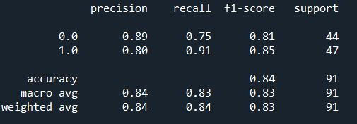

<h1> Heart-Attack-Predictions-App </h1>


# Project Descriptions
<p align="justify"> This project is to create a model that able to make a prediction of heart attack possibilities in a patient. I have deployed an app using Streamlit platform. This project used Logistic Regression classification model of Machine Learning (ML) to predict the required results. This repository consists of mainly python.</p>

## Project Organization
  ```
  ├── Datasets                                    : Contains dataset used 
  ├── Models                                      : Contains model used in Heart_Attack_App Deploy
  ├── Statics                                     : Contains all save image (graphs/heatmap)
  ├── __pycache__                                 : Contains .pyc file
  ├── GitHub_url.txt                              : Github url in .txt
  ├── Heart_Attack_App_deploy.py                  : App deploy in python format
  ├── Heart_Attack_Predictions.py                 : Code file in python format
  └──  README.md                                  : Project Descriptions 
  ```
## Datasets Descriptions
This projects is trained with  [Heart Attack Analysis & Prediction Dataset](https://www.kaggle.com/datasets/rashikrahmanpritom/heart-attack-analysis-prediction-dataset).

1. `Age (age)`: Age of the patient at the time of health checkup
2. `Sex (sex)`: 0 = female and 1 = male
3. `Chest Pain (cp)`: 1 = typical angina, 2 = atypical angina, 3 = non-anginal pain, 4 = asymptotic
4. `Resting Blood Pressure (trestbps)`: Resting blood pressure value of patient in mmHg (unit)
5. `Cholesterol (chol)`: Cholesterol of patient in mg/dl (unit)
6. `Fasting Blood Sugar (fbs)`: 1 = if fbs >120 mg/dl (true), else 0 = if not that (false)
7. `Resting ECG (restecg)`: 0 = normal, 1 = having ST-T wave abnormality, 2 = left ventricular hypertrophy
8. `Max Heart Rate (thalach)`: Maximum heart rate achieved by any patient
9. `Exercise induced angina (exang)`: 0 = No and 1 = Yes
10. `oldpeak`: Displays the value of ST depression of any patient induced by exercise w.r.t. rest (float values)
11. `slp`: Describes the peak of exercise during ST segment, 0 = up-slope, 1 = flat, 2 = down-slope
12. `No. of major vessels (caa)`: Classified in range 0 to 4 by coloring through fluoroscopy
13. `Thalassemia (thall)`: 1 = normal,2 = fixeddefect, 3 = reversible defect
14. `output`: It's the prediction column for diagnosis of heart attacks. Here, 0 = no possibility of heart attack and 1 = possibilities of heart attack

# Requirements
This project is created using Spyder as the main IDE. The main frameworks used in this project are Pandas, Matplotlib, Seaborn, Scikit-learn and Streamlit.

# Methodology
This project contains two .py files. The training and deploy files are Heart_Attack_Predictions.py and Heart_Attack_App_deploy.py respectively. The flow of the projects are as follows:

   ## 1. Importing the libraries and dataset

   The data are loaded from the dataset and usefull libraries are imported.

   ## 2. Exploratory data analysis

   The datasets is cleaned with necessary step. The duplicate is removed. The correlation between features are computed using Logistic Regression (continous vs continous) and Cramer's V (continous vs categorical). From the correlation results, the selected features are `age`, `trtbps`,`chol`,`thalachh`, `oldpeak`, `cp`, `exng`, `caa`, and `thall`.

   ## 3. Machine learning model 

   Few machine learning model suits for binary classfification problem are selected and built into the pipeline using both Min Max Scaler and Standard Scaler such as 

  1. Logistic regression (lr)
  2. K Neighbors Classifier (knn)
  3. Random Forest Classifier (rf)
  4. Support Vector Classifier (svc)
  5. Decision Tree Classifier (dt)

   ## 4. Model Prediction and Accuracy

   The results with the best accuracy score is Logistic Regression (lr), Standard Scaler (ss) with 84 % accuracy score. 
   - The classification report in a image.
   
   
     
   - The classification report in a table is shown below. 
   <!DOCTYPE html>
<html>
 
<head>
</head>
 
<body>
    <table style="width:100%">
        <tr>
            <th></th>
            <th>precision</th>
            <th>recall</th>
            <th>f1-score</th>
            <th>support</th>
        </tr>
        <tr>
            <td>0.0</td>
            <td>0.89</td>          
            <td>0.750</td>
            <td>0.81</td>
            <td>44</td>
        </tr>
        <tr>
            <td>1.0</td>
            <td>0.80</td>          
            <td>0.91</td>
            <td>0.85</td>
            <td>47</td>
        </tr>
        <tr>
            <td>accuracy</td>
            <td></td>          
            <td></td>
            <td>0.84</td>
            <td>91</td>
        </tr>
        <tr>
            <td>macro avg</td>
            <td>0.84</td>          
            <td>0.83</td>
            <td>0.83</td>
            <td>91</td>
        </tr>
        <tr>
            <td>weighted avg</td>
            <td>0.84</td>          
            <td>0.84</td>
            <td>0.83</td>
            <td>91</td>
        </tr>
    </table>
</body>
 
</html>    


   ## 5. Deployment

  The data is then tested with few cases. 

   ## 6. Build the app using Streamlit

   An app to predict the chance of a person to get heart attack is then build using Streamlit. 
   

# Credit
This dataset are from [Heart_Attack_Analysis  Predicctions](https://www.kaggle.com/rashikrahmanpritom/heart-attack-analysis-prediction-dataset)
